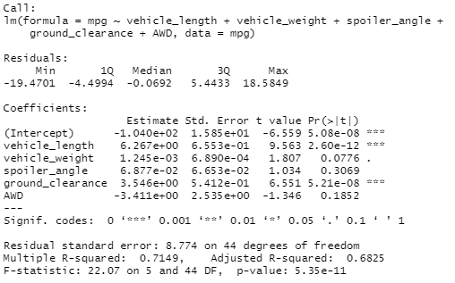
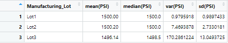
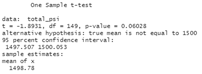
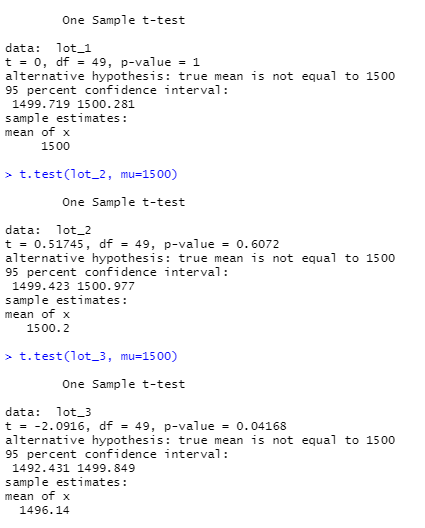

# MechaCar Statistical Analysis

## Project Overview
For this project, I used R Studio to perform linear regressions and T-tests, as well as determined summary statistics, on vehicle performance for MechaCar vehicles.

Additionally, I designed a study to compare the performance of MechaCar vehicles to competing products. 

## Linear Regression to Predict MPG
MechaCar_mpg.csv (included in the Resources folder) provides details on 50 different MechaCar vehicle prototypes, including their Vehicle Length, Vehicle Weight, Spoiler Angle, Ground Clearance, whether or not they have All Wheel Drive (AWD), and their Miles per Gallon (MPG).

Using linear regression on the variables in this file, we can analyze which of these factors have an impact on vehicle mileage.

Vehicle Length and Ground Clearance were the best indicators of vehicle mileage (MPG) for this dataset of 50 MechaCar vehicle prototypes, each producing a p-value of 0.05 or lower, indicating that their relationship on MPG is non-random. Vehicle Weight was related, but with more than a 5% chance the relationship could be produced at random. Spoiler Angle and having AWD were not significantly related to MPG in these vehicles.

* Is the slope of the linear model considered to be zero? Why or why not?

This linear model is a fair predictor of MPG for these vehicles. With an R squared value of 0.71, it is assumed that 71% of the mileage data can be explained by our other variables.

## Summary Statistics on Suspension Coils

By taking a summary of the PSI values for suspension coils, we can see that most coils have around 1500 PSI, but could vary slightly. Based on the standard deviation, we would expect 95% of the suspension coils to be between 1484 and 1516. 

When the statistics are divided out by manufacturing lot, we can see a much different story unfold. For manufacotring lot 1, the PSI is extremely consistent, with 99.7% of data falling within 3 PSI of the mean (with a standard deviation less than 1). However, in lot 2, the standard deviation rises to 13, with 170 as the variance. This alarming difference raises questions on the quality of coils that come from lot 3, and they should be further analyzed for safety and quality control. 

While the variance of all of the suspension coil data has a variance below 100 PSI (coming in just over 62), a breakdown of variance by manufacturing lot shows that nearly all of that variance is coming from lot 3. Lots 1 and 2 are in compliance, but the coils from manufacturing lot 3 fail the design specifications for MechaCar suspension coils - having 170 variance, well over the limit of 100. 

## T-tests on Suspension Coils
To see if the detected discrepancy between manufacturing lots is statistically different (that is, due to random chance or indicative of a manufacturing error or other issue), I performed a T-test comparing the individual lots to the overall mean of 1500 PSI. 

The first lot has a p-value of 1 and a t-value of 0, showing that the mean for Lot 1 is exactly 1500, or the mean for the overall coil PSI. 

The second lot has p=0.6 and t=0.5, with a mean of 1500.2, so Lot 2 also has a fairly close fit to the average coil from all three lots. 

However, the third lot shows a p-value of 0.04 and a t-value of -2.1, which indicates that there is a significant difference between the coils from Lot 3 and the the other two lots. 

Without dividing out the coils based on the manufacturing lot, we get a much different picture of what is going on, as seen below. 

This t-test tells us that the mean (1498.78) is not significantly different than the overall mean, with p=0.06, and could just be random variation within our sample. 

Dividing the manufacturing lots and taking separate t-tests is vital to seeing the discrepancy between PSI in suspension coils from each of the three manufacturing lots. 

## Study Design: MechaCar vs Competition
- Description of a statistical study that can quantify how the MechaCar performs against the competition.
    [Think critically about what metrics would be of interest to a consumer: for a few examples, cost, city or highway fuel efficiency, horse power, maintenance cost, or safety rating]
- Address the following questions:
    * What metric or metrics are you going to test?
    * What is the null hypothesis or alternative hypothesis?
    * What statistical test would you use to test the hypothesis? And why?
    * What data is needed to run the statistical test?